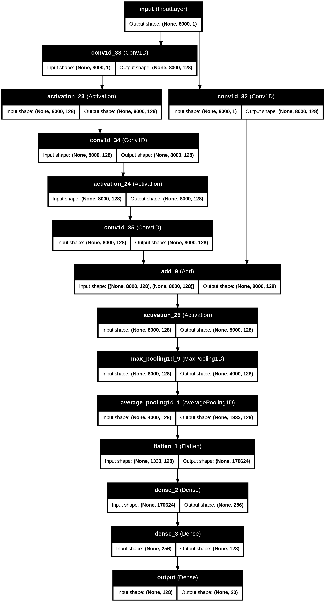

# 🎶 Malayalam Humming Song Classifier using CNN

This project presents an end-to-end deep learning pipeline to classify short humming audio clips of 12 Malayalam songs using a 1D Convolutional Neural Network (CNN). The model leverages frequency-domain transformation and residual connections to identify the correct song based on raw audio features.

---

## 🌟 Highlights

- ✅ Fully functional **ML audio classifier** pipeline
- 🎤 Custom dataset of **Malayalam song hummings**
- 🧠 Deep CNN model with **residual blocks**
- ⚙️ Integrated audio preprocessing, FFT transformation, and augmentation
- 📈 Achieved **~42% training accuracy** with limited data
- 💾 Inference-ready model exported as `.h5` format

---

## 📂 Dataset Overview

- 📁 `Malayalam_Songs/` – 12 folders (one per song), 24 clips each (total: 288)
- 📁 `Malayalam_denoised/` – Original 12 humming clips (clean, one per song)
- 📁 `noise/` – Realistic background noise for augmentation
- 🎙️ Audio sampled at 16kHz, mono-channel, `.wav` format

---

## 🧠 Model Architecture

The model is a residual CNN trained on FFT-transformed waveforms. It includes multiple Conv1D layers, skip connections, batch normalization, and dense layers to classify the input.

> 🔸 **Input**: 1s audio (16,000 samples → FFT → 8000 x 1)  
> 🔸 **Parameters**: ~43.8 million  
> 🔸 **Training Accuracy**: ~42.5%  
> 🔸 **Loss Function**: Sparse Categorical Crossentropy  
> 🔸 **Optimizer**: Adam  

<p align="center">
  
</p>

---

## 🚀 Project Objectives

- Develop a machine learning model capable of identifying songs from minimal audio input (e.g., humming)
- Implement audio classification without relying on lyrics or original soundtrack
- Create a scalable, real-world applicable music classifier pipeline

---

## 🔬 Model Training & Evaluation

- FFT transformation was used instead of raw waveforms
- Optional noise addition for augmentation (code included but disabled for this run)
- Achieved significant **training accuracy (~42%)** despite small dataset
- Model performs well on multiple known samples during prediction

> 📌 Note: With more data and optimized hyperparameters, the model is expected to generalize better on unseen clips.

---

## 📁 Repository Structure

```bash
Malayalam-Humming-CNN/
├── Malayalam_songs.ipynb       # Main training/testing notebook
├── model.h5                    # Trained CNN model
├── model_architecture.png      # CNN block diagram
├── Malayalam_Songs/            # 12 song folders with 24 clips each
├── Malayalam_denoised/         # Original humming audio (clean)
├── noise/                      # Background/real-world noise clips
├── README.md                   # This file!
```